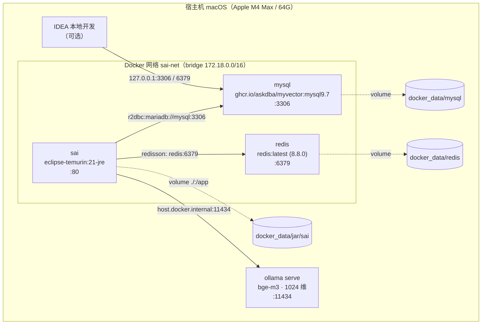

# SAI（云枢）部署文档

> 覆盖范围：**Docker 部署 Redis、MySQL（含 myvector 向量插件）**、**Ollama bge-m3 向量化模型**、SAI 应用容器，以及建库建表与验收。
> 本文所有命令与参数均在本机实际环境验证过（macOS / Apple M4 Max / Docker 29.8.0 / Compose v5.5.1）。

> 🔐 **本文中的密码均为环境变量占位符，使用前请先导出：**
> ```bash
> export SAI_DB_PASSWORD='你的 MySQL/MariaDB root 密码'
> export SAI_REDIS_PASSWORD='你的 Redis 访问密码'
> ```
> 部署目录 `<PROJECT_ROOT>` / `~/Documents/docker_data/...` 请按实际环境替换。

---

## 目录

- [0. 部署拓扑](#0-部署拓扑)
- [1. 环境要求](#1-环境要求)
- [2. 创建 Docker 网络](#2-创建-docker-网络)
- [3. 部署 MySQL（含向量插件 myvector）](#3-部署-mysql含向量插件-myvector)
  - [3.5 进容器手工安装向量插件（补装 / 重装）](#35-进容器手工安装向量插件补装--重装)
- [4. 部署 Redis](#4-部署-redis)
- [5. 部署向量化模型（Ollama + bge-m3）](#5-部署向量化模型ollama--bge-m3)
- [6. 初始化数据库](#6-初始化数据库)
- [7. 部署 SAI 应用](#7-部署-sai-应用)
- [8. 验收清单](#8-验收清单)
- [9. 常见问题](#9-常见问题)
- [10. 日常运维](#10-日常运维)
- [附录 A：一键部署脚本](#附录-a一键部署脚本)
- [附录 B：完整 compose 模板](#附录-b完整-compose-模板)

---

## 0. 部署拓扑



**端口与凭据一览**（当前实际值，切勿直接用于公网环境）：

| 组件 | 镜像 | 端口映射 | 账号 / 密码 | 数据目录 |
|---|---|---|---|---|
| MySQL | `ghcr.io/askdba/myvector:mysql9.7` | `3306:3306` | `root` / `${SAI_DB_PASSWORD}` | `~/Documents/docker_data/mysql` |
| Redis | `redis:latest`（8.8.0） | `6379:6379` | 密码 `${SAI_REDIS_PASSWORD}` | `~/Documents/docker_data/redis` |
| SAI 应用 | `eclipse-temurin:21-jre`（不构建镜像） | `80:80` | `admin` / 见 `application.yml` | `~/Documents/docker_data/jar/sai` |
| Ollama + bge-m3 | Homebrew 原生进程（非容器） | `11434` | 无 | `~/Documents/rag-knowledge-base/models` |

**部署目录规划**：

```
~/Documents/docker_data/
├── mysql/                    # MySQL 数据（容器 /var/lib/mysql）
├── redis/                    # Redis 数据（容器 /data，AOF 持久化）
├── BACK/
│   └── myvector-mysql9.7.tar.gz   # 向量版 MySQL 镜像离线备份（259 MB）
└── jar/sai/                  # SAI 应用部署目录（容器 /app）
    ├── SAI.jar
    ├── application.yml       # 外部覆盖配置
    ├── config/logback.xml
    ├── docker-compose.yml
    ├── log/                  # 应用日志
    └── agentScope/           # Agent 工作区（子智能体/技能/记忆）

~/Documents/rag-knowledge-base/
└── models/                   # Ollama 模型存储（OLLAMA_MODELS）
    ├── blobs/
    ├── manifests/
    └── Modelfile
```

---

## 1. 环境要求

| 项 | 要求 | 本机实测值 |
|---|---|---|
| 操作系统 | macOS / Linux，**arm64 或 amd64** 需与镜像架构一致 | macOS 26.6.2，arm64 |
| Docker | Docker Desktop（含 Compose V2） | 29.8.0 / Compose v5.5.1 |
| JDK（构建用） | **JDK 21**，`maven.compiler.source/target=21` | corretto-21.0.9 |
| Maven | 3.8+ | 3.9.x |
| Ollama | 0.32+ | 0.32.5（Homebrew） |
| 磁盘 | ≥ 10 GB（镜像约 2.1 GB + 数据 + 模型 1.2 GB） | 可用 694 GB |
| 内存 | ≥ 8 GB（MySQL 1.33 GB 镜像 + Ollama 常驻） | 64 GB |

> ⚠️ **构建必须显式指定 JDK 21**。系统默认 JAVA_HOME 可能是更高版本，Lombok 等注解处理器会失败：
> ```bash
> export JAVA_HOME=$(/usr/libexec/java_home -v 21)   # macOS；Linux 请指向 JDK 21 安装目录
> ```
> 另：**不要加 `-o` 离线参数**，本地仓库的 agentscope 构件 `_remote.repositories` 与远端不匹配，离线解析必然失败。

---

## 2. 创建 Docker 网络

三个容器必须位于同一自定义网络，才能用**容器名**互访（`mysql:3306`、`redis:6379`）。

```bash
docker network create sai-net
```

校验（应为 `bridge`，子网 `172.18.0.0/16`）：

```bash
docker network inspect sai-net --format '{{.Name}} {{.Driver}} {{range .IPAM.Config}}{{.Subnet}}{{end}}'
```

> 必须用**自定义网络**而非默认 `bridge`：默认 bridge 不支持容器名 DNS 解析，只能用 IP。

---

## 3. 部署 MySQL（含向量插件 myvector）

### 3.1 镜像说明

本项目用的不是官方 MySQL，而是**内置 myvector 向量插件**的构建版：

| 项 | 值 |
|---|---|
| 镜像 | `ghcr.io/askdba/myvector:mysql9.7` |
| 大小 | 1.33 GB |
| 架构 | `linux/arm64`（Apple Silicon 原生，无需 Rosetta） |
| MySQL 版本 | 9.7.0（`Oracle Linux Server 9.7` / `aarch64`） |
| 插件文件 | `myvector.so`（2.56 MB），镜像内**放了两处**：`/usr/lib64/mysql/plugin/`（= 服务端 `plugin_dir`，生效的那份）与 `/usr/lib/mysql/plugin/` |
| 初始化脚本 | `/docker-entrypoint-initdb.d/myvectorplugin.sql`（镜像内置，**仅在数据目录为空的首次启动时自动执行**，见 3.5） |

> 服务端读的是 `plugin_dir`，本镜像实测为 `/usr/lib64/mysql/plugin/`（**不是** `/usr/lib/mysql/plugin/`，两者是不同目录）。查自己的：`docker exec mysql mysql -uroot -p密码 -N -e "SHOW VARIABLES LIKE 'plugin_dir';"`

**为什么必须用这个镜像**：项目向量列使用 MySQL 9 原生 `VECTOR(1024)` 类型，相似度计算依赖 myvector 提供的 `myvector_distance()` UDF。官方 MySQL 镜像**没有**这个函数，向量检索会直接报 `FUNCTION xxx does not exist`。

#### 获取镜像（三种方式）

```bash
# 方式 1：在线拉取（ghcr.io）
docker pull ghcr.io/askdba/myvector:mysql9.7

# 方式 2：从本机离线备份恢复（推荐，已存在）
gunzip -c ~/Documents/docker_data/BACK/myvector-mysql9.7.tar.gz | docker load

# 方式 3：换源（若 ghcr.io 被墙，可换国内镜像加速）
#   docker pull <你的加速源>/askdba/myvector:mysql9.7
#   docker tag  <你的加速源>/askdba/myvector:mysql9.7 ghcr.io/askdba/myvector:mysql9.7
```

校验：

```bash
docker images --format "{{.Repository}}:{{.Tag}}\t{{.Size}}" | grep myvector
# ghcr.io/askdba/myvector:mysql9.7   1.33GB
```

### 3.2 启动

**推荐方式：compose**（新建 `~/Documents/docker_data/infra/docker-compose.yml`，完整内容见[附录 B](#附录-b完整-compose-模板)）

```bash
mkdir -p ~/Documents/docker_data/infra
cd ~/Documents/docker_data/infra
docker compose up -d mysql
```

**或等价的 `docker run`**：

```bash
docker run -d \
  --name mysql \
  --network sai-net \
  --restart unless-stopped \
  -p 3306:3306 \
  -e MYSQL_ROOT_PASSWORD=${SAI_DB_PASSWORD} \
  -e TZ=Asia/Shanghai \
  -v ~/Documents/docker_data/mysql:/var/lib/mysql \
  ghcr.io/askdba/myvector:mysql9.7 \
  --default-time-zone=+08:00
```

**关键参数**：

| 参数 | 作用 | 不配的后果 |
|---|---|---|
| `MYSQL_ROOT_PASSWORD` | 初始化 root 密码 | 容器启动失败 |
| `-v .../mysql:/var/lib/mysql` | 数据持久化到宿主 | 容器删除即丢库 |
| `--network sai-net` | 与 redis / sai 同网络 | 应用连不上 `mysql:3306` |
| `-p 3306:3306` | 宿主（IDEA 本地开发）可连 | 本地开发无法连库 |
| `TZ=Asia/Shanghai`<br>`--default-time-zone=+08:00` | 修正时区为北京时间 | **时间戳差 8 小时**（见 3.4） |
| `--restart unless-stopped` | 开机/重启自动拉起 | 重启后需手动 start |

> 注意 `--default-time-zone=+08:00` 必须放在**镜像名之后**，作为 mysqld 的启动参数传入。

### 3.3 验证插件已生效

```bash
echo "① 插件与 UDF 注册（完整安装应为 myvector ACTIVE + 7 个函数）"
docker exec mysql mysql -uroot -p${SAI_DB_PASSWORD} -e \
  "SELECT PLUGIN_NAME,PLUGIN_STATUS,PLUGIN_TYPE FROM information_schema.PLUGINS WHERE PLUGIN_NAME LIKE '%vector%';"
docker exec mysql mysql -uroot -p${SAI_DB_PASSWORD} -N -e \
  "SELECT name FROM mysql.func WHERE dl='myvector.so';"

echo "② 向量类型与距离函数冒烟（dim=3, cosine≈0.0085）"
docker exec mysql mysql --default-character-set=utf8mb4 -uroot -p${SAI_DB_PASSWORD} -t -e \
  "SELECT VECTOR_DIM(STRING_TO_VECTOR('[1,2,3]')) AS dim,
          myvector_distance(STRING_TO_VECTOR('[1,2,3]'), STRING_TO_VECTOR('[1,2,4]'), 'COSINE') AS cosine_dist;"
```

预期输出（完整安装）：

```
PLUGIN_NAME  PLUGIN_STATUS  PLUGIN_TYPE
myvector     ACTIVE         AUDIT

myvector_ann_set
myvector_construct
myvector_display
myvector_distance        ← 项目检索依赖此函数（唯一必需）
myvector_is_valid
myvector_row_distance
myvector_search_open_udf

+------+---------------------+
| dim  | cosine_dist         |
+------+---------------------+
|    3 | 0.00853986601633272 |
+------+---------------------+
```

> **判断标准只看这一条**：`myvector_distance` 能调用即可，插件行与其余 6 个 UDF 缺失都不影响项目检索（详见 3.5 的依赖关系表）。
> 若 ② 报 `ERROR 1305 (42000): FUNCTION xxx.myvector_distance does not exist` → 向量插件没装好，转 **3.5**。

**myvector 提供的能力**（供扩展参考）：

| 组件 | 说明 |
|---|---|
| `VECTOR(n)` 列类型 | MySQL 9 原生类型，项目统一用 `VECTOR(1024)` |
| `STRING_TO_VECTOR('[..]')` | JSON 文本 → 向量（应用写入时使用） |
| `VECTOR_TO_STRING(v)` | 向量 → JSON 文本（调试用） |
| `VECTOR_DIM(v)` | 向量维度校验 |
| `myvector_distance(v1, v2, 'COSINE'\|'L2'\|'IP')` | 距离计算，**检索核心** |
| `myvector_is_valid(v, dim)` | 校验向量完整性与维度 |
| `MYVECTOR_INDEX_*` 存储过程 | ANN 索引（**本项目未启用**，见下） |

> **关于 ANN 索引**：项目当前走**全表 `myvector_distance` 打分**（相似度计算下推到数据库，见 `R2dbcClient#fetchAndScore`）。myvector 的 ANN 索引要求向量列注释以 `MYVECTOR COLUMN` 开头，而项目列注释是业务描述（如「bge-m3 向量（1024维）」），且 `mysql.myvector_columns` 视图为空 → **未注册 ANN**。当前数据量下全表扫描足够；数据量增长到十万级以上再考虑启用 ANN 并调整列注释。

### 3.4 两个必知的服务端特性

**① 字符集：服务端 utf8mb4，但客户端默认 latin1**

```bash
docker exec mysql mysql -uroot -p${SAI_DB_PASSWORD} -e \
  "SHOW VARIABLES WHERE Variable_name IN ('character_set_server','collation_server','lower_case_table_names');"
```

```
character_set_server      utf8mb4
collation_server          utf8mb4_0900_ai_ci
lower_case_table_names    2
```

服务端没问题，但容器内 `mysql` **命令行客户端默认 `character_set_client=latin1`**。这意味着：

> 🔴 **导入含中文的 SQL 时，必须显式加 `--default-character-set=utf8mb4`**，否则中文注释/默认值会被二次编码成乱码（本项目已实际踩过此坑，`sql/sai.sql` 和库中 26 处注释曾被写坏）。

```bash
# ✅ 正确
docker exec -i mysql mysql --default-character-set=utf8mb4 -uroot -p${SAI_DB_PASSWORD} sai < xxx.sql

# ❌ 错误（中文必乱码）
docker exec -i mysql mysql -uroot -p${SAI_DB_PASSWORD} sai < xxx.sql
```

排查/修复全库乱码：项目级技能 `.workbuddy/skills/sai-mysql-utf8/`（含 `mojibake.py`：`scan` / `fix-file` / `scan-db` / `fix-db-sql`）。

**② 时区：容器默认 UTC，比北京时间早 8 小时**

```bash
docker exec mysql mysql -uroot -p${SAI_DB_PASSWORD} -e "SELECT NOW(), UTC_TIMESTAMP(), @@session.time_zone;"
# 未修正时：NOW() = 07:47（UTC），宿主实际 15:47（CST）
```

影响：`create_time` / `update_time` 由 DB `CURRENT_TIMESTAMP` 写入 → 存 UTC；而 Java 侧 `LocalDateTime.now()` 写入的字段是北京时间 → **同一时刻的两类时间戳差 8 小时**。

已在 3.2 的启动参数中通过 `TZ=Asia/Shanghai` + `--default-time-zone=+08:00` 修正（镜像内置 tzdata，两种方式均有效，`--default-time-zone` 更确定）。校验：

```bash
docker exec mysql mysql -uroot -p${SAI_DB_PASSWORD} -e "SELECT NOW() AS db_now, @@session.time_zone AS tz;"
# 期望：与宿主 date 一致，tz = +08:00
```

### 3.5 进容器手工安装向量插件（补装 / 重装）

> 本节所有命令均在本机实测（`ghcr.io/askdba/myvector:mysql9.7`，含"清空注册 → 重新安装 → 重启验证"的完整回归）。

#### 3.5.1 什么时候需要手工装

镜像里那份 `/docker-entrypoint-initdb.d/myvectorplugin.sql` 由 **MySQL 官方 entrypoint** 执行，而 entrypoint **只在数据目录为空的首次初始化时**才跑脚本。所以会出现"镜像里带了插件，但库里没注册"：

| 场景 | 是否自动装好 |
|---|---|
| 全新 `docker run`，`-v` 指向空目录 | ✅ 首次启动自动执行 |
| `-v` 指向**已有数据**的目录（如本项目 `~/Documents/docker_data/mysql`） | ❌ 初始化不再执行 → 手工装 |
| 用官方 `mysql:9.x` 镜像 | ❌ 镜像内既无 `.so` 也无脚本 → 手工装 |
| 删掉数据目录后重新初始化 | ✅ 会再次自动执行 |
| 仅仅 `docker restart` / 重建容器（数据目录在） | 注册信息在数据目录里，**不会丢，无需重装** |

先自查，决定要不要动手：

```bash
docker exec mysql mysql -uroot -p${SAI_DB_PASSWORD} -N -e \
  "SELECT name FROM mysql.func WHERE dl='myvector.so';"
# 有 myvector_distance → 已装好，跳过本节
# 无任何输出        → 按 3.5.3（本项目镜像）或 3.5.4（官方镜像）装
```

#### 3.5.2 依赖关系（排障先看这张表）

| 组成 | 位置 | 作用 | 缺失时的现象 |
|---|---|---|---|
| `myvector.so` | `plugin_dir` = `/usr/lib64/mysql/plugin/` | UDF 的二进制实现 | 启动日志 `[ERROR] [MY-010901] Can't open shared library '.../myvector.so'` + `[Warning] [MY-010736] Couldn't load plugin named 'myvector'`；查询报 `ERROR 1305 FUNCTION xxx.myvector_distance does not exist` |
| `mysql.func` 表中的 UDF 行 | 数据目录（持久化） | 函数名注册（`CREATE FUNCTION ... SONAME`） | 同上，`ERROR 1305 ... does not exist` |
| `mysql.plugin` 表中的 `myvector` 行 | 数据目录（持久化） | AUDIT 型插件注册（ANN 索引用） | 项目检索不受影响（项目只用 `myvector_distance`） |

三条实测结论，先记住可少走弯路：

1. **让 `myvector_distance` 可用的是 `mysql.func` 里那条 `CREATE FUNCTION`，不是 `INSTALL PLUGIN`。** 实测 `UNINSTALL PLUGIN myvector` 之后该函数依旧返回正确结果。
2. `STRING_TO_VECTOR` / `VECTOR_TO_STRING` / `VECTOR_DIM` 是 **MySQL 9 原生函数**，不依赖插件（卸载插件后实测仍可用）。
3. **生效时机**：`INSTALL PLUGIN` / `CREATE FUNCTION` 立即生效，不用重启；但**替换 `.so` 文件后必须 `docker restart mysql` 才会重新加载**（实测：`.so` 移走后重启 → 插件加载失败、`information_schema.PLUGINS` 中查不到该行）。

#### 3.5.3 场景 A：本项目镜像（`.so` 就在容器里，只是没注册）— 推荐

```bash
# ① 确认 plugin_dir 与 .so 在位
docker exec mysql mysql -uroot -p${SAI_DB_PASSWORD} -N -e "SHOW VARIABLES LIKE 'plugin_dir';"
# plugin_dir	/usr/lib64/mysql/plugin/
docker exec mysql ls -la /usr/lib64/mysql/plugin/myvector.so
# -rwxr-xr-x 1 root root 2556896 ... myvector.so

# ② 清掉可能的残留注册行（避免 ERROR 3883；没有残留时执行也安全）
docker exec mysql mysql -uroot -p${SAI_DB_PASSWORD} -D mysql -e \
  "DELETE FROM mysql.plugin WHERE name='myvector';"

# ③ 重放镜像内置脚本：插件 + 7 个 UDF + myvector_columns 视图 + 6 个 ANN 存储过程，一次装全
docker exec -i mysql sh -c \
  'mysql -uroot -p${SAI_DB_PASSWORD} --force < /docker-entrypoint-initdb.d/myvectorplugin.sql'

# ④ 验证
docker exec mysql mysql -uroot -p${SAI_DB_PASSWORD} -t -e \
  "SELECT myvector_distance(STRING_TO_VECTOR('[1,2,3]'), STRING_TO_VECTOR('[1,2,4]'), 'COSINE') AS cosine_dist;"
# +---------------------+
# | cosine_dist         |
# +---------------------+
# | 0.00853986601633272 |
# +---------------------+
```

**为什么第 ③ 步要加 `--force`**：脚本第 32 行是 `INSTALL PLUGIN myvector SONAME 'myvector.so';`，插件已注册时会报
`ERROR 1125 (HY000): Function 'myvector' already exists`。`--force` 让客户端跳过这条错、继续执行后面的 UDF 注册；**这条报错可以忽略**。不加 `--force` 会在这行中断，后面的 UDF 全都建不出来。

实测重放结果：`myvector ACTIVE` / `mysql.func` 7 行 / `information_schema.ROUTINES` 6 个 / `myvector_columns` 视图 1 个，`docker restart mysql` 后仍全部有效。

#### 3.5.4 场景 B：官方 MySQL 镜像（需要把 `.so` 拷进容器）

```bash
# ① 在宿主执行：从本项目镜像里取出 .so 与脚本（一次性）
docker create --name mv-tmp ghcr.io/askdba/myvector:mysql9.7
docker cp mv-tmp:/usr/lib64/mysql/plugin/myvector.so            ./myvector.so
docker cp mv-tmp:/docker-entrypoint-initdb.d/myvectorplugin.sql ./myvectorplugin.sql
docker rm mv-tmp
ls -la ./myvector.so ./myvectorplugin.sql
# myvector.so 应为 2556896 字节、myvectorplugin.sql 7506 字节

# ② 确认目标容器的 plugin_dir，再把两个文件拷进去
docker exec mysql mysql -uroot -p<密码> -N -e "SHOW VARIABLES LIKE 'plugin_dir';"
docker cp ./myvector.so        mysql:/usr/lib64/mysql/plugin/myvector.so
docker cp ./myvectorplugin.sql mysql:/tmp/myvectorplugin.sql

# ③ 清残留行 + 重放脚本（命令同 3.5.3 的 ② ③，脚本路径换成 /tmp/myvectorplugin.sql）
# ④ 验证（同 3.5.3 的 ④）
```

⚠️ **版本与架构约束**：`myvector.so` 是针对 **MySQL 9.7.0 / Linux aarch64** 构建的（`ldd` 仅依赖 `libm.so.6`、`libc.so.6` 与 `ld-linux-aarch64.so.1`）。目标库需同为 **9.x 且同架构**；换成 MySQL 8.4 或 x86_64 机器能否加载**未验证**。稳妥做法：目标机直接用 `ghcr.io/askdba/myvector:mysql9.7`，别去改造官方镜像。

#### 3.5.5 常见报错对照

| 报错 / 现象 | 根因 | 处理 |
|---|---|---|
| `ERROR 1305 (42000): FUNCTION xxx.myvector_distance does not exist` | `.so` 不在 `plugin_dir`，或 `mysql.func` 中无该 UDF | 按 3.5.3 / 3.5.4 安装；先看 `docker logs mysql \| grep MY-010901`，若报 `Can't open shared library` 就是 `.so` 路径不对 |
| `ERROR 3883 (HY000): Error installing plugin 'myvector': got 'Operation not permitted' writing to mysql.plugin` | `mysql.plugin` 里已有 `myvector` 残留行，但插件并未加载成功 → `INSTALL PLUGIN` 写不进去（此时 `UNINSTALL PLUGIN` 又会报 `PLUGIN myvector does not exist`） | `DELETE FROM mysql.plugin WHERE name='myvector';` 再装（实测删除后立即成功） |
| `ERROR 1125 (HY000): Function 'myvector' already exists` | 插件已注册时重复执行 `INSTALL PLUGIN` | 无害。用 `--force` 重放脚本，或跳过该行 |
| `ERROR 1046 (3D000): No database selected` | 无默认库时调用 UDF，而该 UDF 实际**未加载成功**（真错因是 `.so` 缺失） | 先解决 `.so`；调试时显式加 `-D mysql` 才能看到真实的 1305 报错 |
| `sh: which: command not found` | 该镜像基于 Oracle Linux 精简版，**无 `which`**（也无 `nc`，但有 `curl`） | 用 `command -v` 或直接 `ls` 代替 |

#### 3.5.6 最小安装（只要检索能力）

项目只用 `myvector_distance`（在 `R2dbcClient` 拼向量检索 SQL 时使用，见该类 `buildVectorSearchSql`）。不想引入 AUDIT 插件与 ANN 存储过程时，只建 UDF 就够：

```sql
-- 存为 /tmp/myvector_min.sql
CREATE FUNCTION myvector_construct     RETURNS STRING  SONAME 'myvector.so';
CREATE FUNCTION myvector_display       RETURNS STRING  SONAME 'myvector.so';
CREATE FUNCTION myvector_distance      RETURNS REAL    SONAME 'myvector.so';
CREATE FUNCTION myvector_is_valid      RETURNS INTEGER SONAME 'myvector.so';
CREATE FUNCTION myvector_row_distance  RETURNS REAL    SONAME 'myvector.so';
```

```bash
docker exec -i mysql sh -c 'mysql -uroot -p${SAI_DB_PASSWORD} -D mysql < /tmp/myvector_min.sql'
```

实测：**不执行 `INSTALL PLUGIN` 也能正常检索** —— 建完 UDF 后 `information_schema.PLUGINS` 中查不到 myvector 行，但 `1 - myvector_distance(..., 'COSINE')` 排序结果正确。

端到端自测（临时表验证 `VECTOR(1024)` 列与余弦排序）：

```bash
docker exec mysql mysql -uroot -p${SAI_DB_PASSWORD} -e \
  "CREATE DATABASE IF NOT EXISTS probe_db DEFAULT CHARACTER SET utf8mb4;"
docker exec mysql mysql -uroot -p${SAI_DB_PASSWORD} -D probe_db -e \
  "CREATE TABLE t_vec (id BIGINT PRIMARY KEY AUTO_INCREMENT, name VARCHAR(32), embedding_vec VECTOR(1024) COMMENT '测试向量');"
docker exec mysql mysql -uroot -p${SAI_DB_PASSWORD} -D probe_db -e \
  "INSERT INTO t_vec (name, embedding_vec) SELECT 'a', STRING_TO_VECTOR(CONCAT('[',REPEAT('0.1,',1023),'0.1]'));"
docker exec mysql mysql -uroot -p${SAI_DB_PASSWORD} -D probe_db -t -e \
  "SELECT id, name, (1 - myvector_distance(STRING_TO_VECTOR(CONCAT('[',REPEAT('0.1,',1023),'0.1]')), embedding_vec, 'COSINE')) AS score FROM t_vec ORDER BY score DESC;"
# 期望 score ≈ 1
```

用完清理：`docker exec mysql mysql -uroot -p${SAI_DB_PASSWORD} -e "DROP DATABASE probe_db;"`

---

## 4. 部署 Redis

Redis 用于 **Redisson 分布式状态 / 会话 / 缓存**（项目配置 `spring.data.redis`）。

### 4.1 启动

```bash
cd ~/Documents/docker_data/infra
docker compose up -d redis
```

**或 `docker run`**：

```bash
docker run -d \
  --name redis \
  --network sai-net \
  --restart unless-stopped \
  -p 6379:6379 \
  -v ~/Documents/docker_data/redis:/data \
  redis:latest \
  redis-server --requirepass ${SAI_REDIS_PASSWORD} --appendonly yes
```

**关键参数**：

| 参数 | 作用 |
|---|---|
| `--requirepass ${SAI_REDIS_PASSWORD}` | 访问密码，需与 `application.yml` 的 `spring.data.redis.password` 一致 |
| `--appendonly yes` | 开启 AOF 持久化（每秒 fsync），容器重建不丢状态 |
| `-v .../redis:/data` | 数据落宿主（`appendonlydir/`） |
| `--network sai-net` | 应用用 `redis:6379` 访问 |

### 4.2 验证

```bash
echo "① 连通性与鉴权"
docker exec redis redis-cli -a ${SAI_REDIS_PASSWORD} --no-auth-warning PING
# PONG

echo "② 关键配置"
docker exec redis redis-cli -a ${SAI_REDIS_PASSWORD} --no-auth-warning CONFIG GET requirepass appendonly maxmemory

echo "③ 跨容器 DNS 解析（应用能否用容器名找到它）"
docker exec redis getent hosts redis mysql
# 172.18.0.2      redis
# 172.18.0.3      mysql
```

> `maxmemory=0`（不限制）。生产环境建议设 `maxmemory` + `maxmemory-policy allkeys-lru`，避免 Redis 吃满宿主内存。

---

## 5. 部署向量化模型（Ollama + bge-m3）

项目通过 `EmbeddingClient` 调用 Ollama 的 bge-m3 模型完成向量化（1024 维，多语言/中文友好）。**Ollama 部署在宿主而非容器内**——因为 Apple Silicon 上容器无法直接使用 GPU/Metal 加速。

对应配置（`application-agent.yml` 与部署用 `application.yml`）：

```yaml
agentScope:
  embedding:
    enabled: true
    base-url: http://127.0.0.1:11434      # 宿主机本地开发用
    api-path: /api/embed
    model: bge-m3
    format: ollama
    timeout-ms: 30000
    vector-dimensions: 1024               # bge-m3 输出维度，0 = 不校验
```

> 容器部署时 `base-url` 必须改为 `http://host.docker.internal:11434`（见 [7.3](#73-启动应用)）。

### 5.1 安装 Ollama

```bash
brew install ollama
ollama --version        # 0.32.5
```

### 5.2 锁定模型存储目录（推荐）

模型默认落在 `~/.ollama/models`。本项目统一放在 `~/Documents/rag-knowledge-base/models`，通过 **LaunchAgent** 固化（开机自启 + 环境变量）：

已生成的文件 `~/Library/LaunchAgents/com.user.ollama.plist`：

```xml
<dict>
    <key>Label</key><string>com.user.ollama</string>
    <key>EnvironmentVariables</key>
    <dict>
        <key>OLLAMA_MODELS</key><string>~/Documents/rag-knowledge-base/models</string>
        <key>OLLAMA_HOST</key><string>0.0.0.0:11434</string>
    </dict>
    <key>ProgramArguments</key>
    <array><string>/opt/homebrew/bin/ollama</string><string>serve</string></array>
    <key>RunAtLoad</key><true/>
    <key>KeepAlive</key><true/>
    <key>StandardOutPath</key><string>~/Library/Logs/ollama-rag.log</string>
    <key>StandardErrorPath</key><string>~/Library/Logs/ollama-rag.err</string>
</dict>
```

加载：

```bash
launchctl load  ~/Library/LaunchAgents/com.user.ollama.plist
# 卸载：launchctl unload ~/Library/LaunchAgents/com.user.ollama.plist
```

> `OLLAMA_HOST=0.0.0.0:11434` 是**容器访问的前提**——若只监听 `127.0.0.1`，容器经 `host.docker.internal` 连不上。生产环境请改用防火墙限制来源。

**临时方式**（不装 LaunchAgent）：

```bash
export OLLAMA_MODELS=~/Documents/rag-knowledge-base/models
ollama serve > ~/Documents/rag-knowledge-base/logs/ollama.log 2>&1 &
```

### 5.3 拉取 bge-m3 模型

```bash
# 必须先导出 OLLAMA_MODELS，否则权重落进默认目录
export OLLAMA_MODELS=~/Documents/rag-knowledge-base/models
ollama pull bge-m3

# 核对（应看到 bge-m3:latest，约 1.16 GB）
ollama list
```

**离线构建**（无外网时用本地 GGUF）：

```bash
cd ~/Documents/rag-knowledge-base/models
cat Modelfile          # 内容：FROM ./bge-m3.gguf
ollama create bge-m3 -f Modelfile
```

### 5.4 验证模型可用

```bash
echo "① 服务探活"
curl -s http://127.0.0.1:11434/api/tags | python3 -m json.tool | head -20

echo "② 单条向量化（OpenAI 风格 /api/embeddings）"
curl -s -X POST http://127.0.0.1:11434/api/embeddings \
  -H "Content-Type: application/json" \
  -d '{"model":"bge-m3","prompt":"测试文本"}' \
  | python3 -c "import sys,json; d=json.load(sys.stdin); print('维度 =', len(d['embedding']))"
# 维度 = 1024

echo "③ 批量向量化（本项目批量走 /api/embed）"
curl -s -X POST http://127.0.0.1:11434/api/embed \
  -H "Content-Type: application/json" \
  -d '{"model":"bge-m3","input":["文本一","文本二"]}' \
  | python3 -c "import sys,json; d=json.load(sys.stdin); print('条数 =', len(d['embeddings']), '维度 =', len(d['embeddings'][0]))"
# 条数 = 2 维度 = 1024
```

| 接口 | 用途 | 请求体字段 |
|---|---|---|
| `POST /api/embeddings` | **单条**向量化 | `prompt` |
| `POST /api/embed` | **批量**向量化 | `input`（数组） |
| `GET /api/tags` | 探活 / 列出模型 | — |

> 项目配置里的 `api-path: /api/embed` 在 `format: ollama` 下会被忽略：`EmbeddingClient` 按 ollama 约定**单条走 `/api/embeddings`、批量走 `/api/embed`**。

### 5.5 容器 → 宿主 Ollama 的连通性

容器内通过 `host.docker.internal` 访问宿主（依赖 compose 里的 `extra_hosts`）：

```yaml
extra_hosts:
  - "host.docker.internal:host-gateway"
```

`eclipse-temurin:21-jre` 镜像内置 `bash` / `sh` / `curl` / `wget`（无 `nc`），可直接从应用容器探测：

```bash
# 容器 → 宿主 ollama（验证 extra_hosts 与 OLLAMA_HOST 都配对）
docker exec sai curl -s http://host.docker.internal:11434/api/tags | head -c 200

# 容器 → mysql / redis（验证 sai-net 容器名解析）
docker exec sai bash -c 'echo > /dev/tcp/mysql/3306 && echo "mysql:3306 可达"'
docker exec sai bash -c 'echo > /dev/tcp/redis/6379 && echo "redis:6379 可达"'
```

> 本机 `HTTP_PROXY/HTTPS_PROXY=http://127.0.0.1:52256` 是 WorkBuddy 沙箱代理（仅 loopback 可用），**不要**给 Docker 配这个代理——Docker VM 经 `host.docker.internal` 够不到它。

---

## 6. 初始化数据库

### 6.1 创建库

```bash
docker exec -i mysql mysql --default-character-set=utf8mb4 -uroot -p${SAI_DB_PASSWORD} <<'SQL'
CREATE DATABASE IF NOT EXISTS `sai`
  DEFAULT CHARACTER SET utf8mb4
  COLLATE utf8mb4_unicode_ci;
SQL
```

> 数据源连接串是 `r2dbc:mariadb://mysql:3306/sai`，库名必须是 `sai`。

### 6.2 导入建表脚本（**必须带 utf8mb4**）

```bash
cd <PROJECT_ROOT>

# 关键：--default-character-set=utf8mb4，否则中文注释与默认值全部乱码
docker exec -i mysql mysql --default-character-set=utf8mb4 -uroot -p${SAI_DB_PASSWORD} sai < sql/sai.sql

# 脚本首行建议自带 SET NAMES utf8mb4;（双重保险）
```

校验**中文注释未乱码**（重点检查表注释与 `received_email` 字段注释）：

```bash
docker exec mysql mysql --default-character-set=utf8mb4 -uroot -p${SAI_DB_PASSWORD} -e \
  "SELECT TABLE_NAME, TABLE_COMMENT FROM information_schema.TABLES WHERE TABLE_SCHEMA='sai' ORDER BY TABLE_NAME;"
```

若已乱码，用技能脚本检测与修复：

```bash
python3 .workbuddy/skills/sai-mysql-utf8/scripts/mojibake.py scan-db          # 检测
python3 .workbuddy/skills/sai-mysql-utf8/scripts/mojibake.py fix-db-sql        # 生成修复 SQL
```

### 6.3 表清单（12 张）

| 表 | 用途 | 向量列 |
|---|---|---|
| `client_conversation` | 会话 | — |
| `client_message` | 消息 | — |
| `knowledge_base` | 知识库 | — |
| `knowledge_chunk` | 知识库分块 | ✅ `vector(1024)` |
| `received_email` | 邮件收发记录（`direction` 0 收 1 发） | ✅ |
| `agent_memory` | Agent 长期记忆 | ✅ |
| `notify_message` | 站内通知 | — |
| `schedule_task` | 定时任务定义 | — |
| `schedule_log` | 定时任务执行日志 | — |

校验：

```bash
docker exec mysql mysql --default-character-set=utf8mb4 -uroot -p${SAI_DB_PASSWORD} -N -e "SHOW TABLES FROM sai;" | cat -n
# 应输出 9 张表
```

### 6.4 自动建表开关（建议关闭）

`SchemaInitRunner` 在 `sai.schema.auto-init=true` 时，启动期会比对表并**仅补建缺失的表**（不触碰已存在的表）。但有两个限制：

1. **覆盖不全**：`EXPECTED_TABLES` 只含 6 张表 —— `client_conversation`、`client_message`、`knowledge_base`、`knowledge_chunk`、`notify_message`、`agent_memory`。**不含** `received_email`、`schedule_task`、`schedule_log`。
2. **来源容易混淆**：jar 内 `application.yml` 已写 `sai.schema.auto-init: false`。经**真实部署日志验证**，该值确实生效（外部配置未覆盖的键会沿用 jar 内取值）：

   ```
   [SchemaInit] 自动初始化已关闭 (sai.schema.auto-init=false)，跳过
   ```

> 📌 结论：**首次部署一律执行 6.2 的手动导入**，并在部署用 `application.yml` 里显式声明 `sai.schema.auto-init: false`（消除歧义，也避免误开后被 6 张表的白名单误导）。自动建表只当兜底，不能替代导入。

### 6.5 定时任务注册行

`sql/sai.sql` **不含任何 INSERT 语句**（该文件语义为 schema-only 建表脚本）。定时任务数据需单独维护，例如邮件抓取任务：

```sql
INSERT INTO `schedule_task`
  (`name`,`group_name`,`invoke_target`,`cron`,`timeout`,`concurrent`,`status`,`remark`)
VALUES
  ('email-fetch','DEFAULT','emailReceiveService.fetchAndStore()','0 0/5 * * * ?',300,0,1,'每5分钟拉取收件箱并入库')
ON DUPLICATE KEY UPDATE `invoke_target`=VALUES(`invoke_target`), `cron`=VALUES(`cron`), `status`=VALUES(`status`);
```

> ⚠️ `invoke_target` 的 bean 名必须与 `@Service("...")` 一致，且需在 `sai.schedule.allowed-beans` 白名单内，否则任务会以 `No bean named 'xxx' available` 失败。

---

## 7. 部署 SAI 应用

应用**不构建镜像**：直接用 `eclipse-temurin:21-jre`，把整个部署目录挂到容器 `/app`。换 jar 后 `--force-recreate` 即可，无需 rebuild。

### 7.1 构建 jar

```bash
cd <PROJECT_ROOT>
export JAVA_HOME=$(/usr/libexec/java_home -v 21)   # macOS；Linux 请指向 JDK 21 安装目录

mvn clean package -DskipTests
# 产物：sai-admin/target/SAI.jar（finalName=SAI，约 91 MB）

# 拷到部署目录
cp sai-admin/target/SAI.jar ~/Documents/docker_data/jar/sai/SAI.jar
```

产物结构（**单包 + 嵌套 jar**，查配置时注意）：

```
SAI.jar
├── META-INF/MANIFEST.MF
│     Main-Class:  org.springframework.boot.loader.launch.JarLauncher
│     Start-Class: xsl.sai.SpringMain
├── BOOT-INF/classes/                 ← sai-admin 的类 + application.yml
│   └── application.yml               ← 打包内默认值
└── BOOT-INF/lib/
    ├── sai-framework-1.0-SNAPSHOT.jar   ← 含 sql/sai.sql（classpath:sql/sai.sql）
    ├── sai-agent-1.0-SNAPSHOT.jar
    ├── sai-client-1.0-SNAPSHOT.jar
    ├── sai-schedule-1.0-SNAPSHOT.jar
    └── sai-page-1.0-SNAPSHOT.jar
```

> 各模块的 `application-{profile}.yml` 在**各自的嵌套 jar 内**，直接 `unzip -l SAI.jar` 查不到，需先解出嵌套 jar。

### 7.2 部署目录

```
~/Documents/docker_data/jar/sai/
├── SAI.jar
├── application.yml           # 外部覆盖配置（file:./ 优先级高于 jar 内 classpath）
├── config/logback.xml
├── docker-compose.yml
├── log/                      # 容器 /app/log
└── agentScope/               # 容器 /app/agentScope
```

**`application.yml`（部署用外部覆盖文件）**：

```yaml
server:
  port: 80

spring:
  r2dbc:
    # 容器内用容器名 mysql；本地 IDEA 开发改为 127.0.0.1
    url: r2dbc:mariadb://mysql:3306/sai?sslMode=disable&allowPublicKeyRetrieval=true
    username: root
    password: ${SAI_DB_PASSWORD}
    pool:
      enabled: true
  data:
    redis:
      host: redis              # 容器内用容器名；本地开发改 127.0.0.1
      port: 6379
      password: ${SAI_REDIS_PASSWORD}
      database: 0
      fail-fast: false

agentScope:
  workspace: /app/agentScope   # 绝对路径，映射到宿主 .../sai/agentScope
  models:
    modelName: deepseek-v4-flash
    apiKey: sk-xxxxxxxxxxxxxxxx
    apiBase: https://api.deepseek.com
    temperature: 0.2
    maxTokens: 4000
  embedding:
    enabled: true
    # ollama 跑在宿主，容器内必须走 host.docker.internal
    base-url: http://host.docker.internal:11434
    api-path: /api/embed
    model: bge-m3
    format: ollama
    timeout-ms: 30000
    vector-dimensions: 1024

sai:
  agent:
    init:
      enabled: true
      # 容器部署必须 false！jar 内默认 true 会每次启动清空工作区并覆盖模板，
      # 抹掉 agent 运行期沉淀的 MEMORY.md 与自定义子智能体。
      force: false
  schema:
    auto-init: false           # 显式关闭，改用 6.2 手动导入
  auth:
    accounts:
      - username: admin
        password: <改成你的强密码>
        display-name: Admin
```

> 🔴 **`sai.agent.init.force` 必须为 `false`**。这是三条硬规则里最容易踩的一条：设 `true` 时每次重启都会把 `agentScope/workspace` 重置，agent 学到的长期记忆与自定义子智能体全部丢失。

**`config/logback.xml`** 关键点（完整内容见技能模板）：

```xml
<property name="LOG_HOME" value="/app/log"/>
<appender name="file" class="ch.qos.logback.core.rolling.RollingFileAppender">
    <file>${LOG_HOME}/sai.log</file>
    <rollingPolicy class="ch.qos.logback.core.rolling.SizeAndTimeBasedRollingPolicy">
        <fileNamePattern>${LOG_HOME}/sai.%d{yyyy-MM-dd}.%i.log</fileNamePattern>
        <maxFileSize>100MB</maxFileSize>
        <maxHistory>15</maxHistory>
        <totalSizeCap>2GB</totalSizeCap>
    </rollingPolicy>
    ...
</appender>
```

### 7.3 启动应用

`docker-compose.yml`：

```yaml
services:
  sai:
    image: eclipse-temurin:21-jre
    container_name: sai
    working_dir: /app
    command:
      - java
      # Spring Boot 3.4+ 只认 logging.config，用 logback.configurationFile 会导致日志文件 0 字节
      - -Dlogging.config=/app/config/logback.xml
      - -Duser.timezone=Asia/Shanghai
      - -Xms512m
      - -Xmx2048m
      - -jar
      - /app/SAI.jar
    environment:
      TZ: Asia/Shanghai
      # 外层 application.yml 整份顶替 jar 内同名文件，jar 内 spring.profiles.active 不生效，
      # 必须在此显式激活 5 个 profile
      SPRING_PROFILES_ACTIVE: framework,agent,client,schedule,page
    ports:
      - "80:80"
    volumes:
      - ./:/app
    extra_hosts:
      - "host.docker.internal:host-gateway"
    networks:
      - sai-net
    restart: unless-stopped
    healthcheck:
      test: ["CMD-SHELL", "bash -c 'echo > /dev/tcp/127.0.0.1/80' || exit 1"]
      interval: 30s
      timeout: 5s
      retries: 5
      start_period: 60s

networks:
  sai-net:
    external: true
```

启动：

```bash
cd ~/Documents/docker_data/jar/sai
docker compose up -d
docker compose logs -f sai        # 观察启动日志
```

### 7.4 三条硬规则（违反必踩坑）

1. **日志必须用 `-Dlogging.config=/app/config/logback.xml`**。Spring Boot 3.4+ **忽略** `-Dlogback.configurationFile`，用后者会导致日志文件被创建但始终 0 字节。
2. **`sai.agent.init.force: false`**。否则每次重启清空 Agent 工作区。
3. **容器内访问依赖一律用容器名**（`mysql` / `redis`），不要用 `127.0.0.1`；访问宿主服务用 `host.docker.internal`。

---

## 8. 验收清单

### 8.1 基础设施

```bash
echo "① 三个容器状态（mysql 应为 healthy，sai 应为 Up healthy）"
docker ps --format "table {{.Names}}\t{{.Status}}\t{{.Ports}}" | grep -E "mysql|redis|sai"

echo "② sai-net 成员（应含 mysql / redis / sai）"
docker network inspect sai-net --format '{{range .Containers}}{{.Name}} {{.IPv4Address}}{{"\n"}}{{end}}'

echo "③ MySQL 向量插件"
docker exec mysql mysql -uroot -p${SAI_DB_PASSWORD} -N -e \
  "SELECT CONCAT(PLUGIN_NAME,' ',PLUGIN_STATUS) FROM information_schema.PLUGINS WHERE PLUGIN_NAME='myvector';"

echo "④ Redis"
docker exec redis redis-cli -a ${SAI_REDIS_PASSWORD} --no-auth-warning PING

echo "⑤ Ollama + bge-m3"
curl -s http://127.0.0.1:11434/api/tags | head -c 200
```

### 8.2 数据库

```bash
echo "① 9 张表"
docker exec mysql mysql --default-character-set=utf8mb4 -uroot -p${SAI_DB_PASSWORD} -N -e "SHOW TABLES FROM sai;" | wc -l

echo "② 中文注释无乱码"
docker exec mysql mysql --default-character-set=utf8mb4 -uroot -p${SAI_DB_PASSWORD} -N -e \
  "SELECT TABLE_COMMENT FROM information_schema.TABLES WHERE TABLE_SCHEMA='sai' AND TABLE_NAME='received_email';"

echo "③ 时区正确（应与宿主一致）"
docker exec mysql mysql -uroot -p${SAI_DB_PASSWORD} -e "SELECT NOW();"; date '+%Y-%m-%d %H:%M:%S'
```

### 8.3 应用端到端

```bash
BASE=http://127.0.0.1

echo "① 首页 200"
curl -s -o /dev/null -w "HTTP=%{http_code}\n" $BASE/

echo "② 登录（账号见 application.yml 的 sai.auth.accounts）"
TOKEN=$(curl -s -X POST $BASE/api/auth/login -H "Content-Type: application/json" \
  -d '{"username":"admin","password":"<你的密码>"}' \
  | python3 -c "import sys,json; print(json.load(sys.stdin)['data']['token'])")
echo "token 长度 = ${#TOKEN}"

echo "③ 业务接口（证明 DB 通）"
for ep in "/api/stats/dashboard" "/api/knowledge/page?pageNum=1&pageSize=3" \
          "/api/email/list?page=1&size=3" "/api/schedule/page?page=1&size=5"; do
  printf "%-42s " "$ep"
  curl -s "$BASE$ep" -H "Authorization: Bearer $TOKEN" | head -c 80; echo
done

echo "④ 日志落盘且在增长"
wc -l ~/Documents/docker_data/jar/sai/log/sai.log; sleep 3
wc -l ~/Documents/docker_data/jar/sai/log/sai.log

echo "⑤ 启动日志锚点（逐条比对，见下表）"
docker logs sai 2>&1 | grep -E "\[SchemaInit\]|\[AgentInit\]|\[向量化\]|\[Quartz\]|Netty started"
```

**启动日志锚点**（下表为真实部署的原始输出，逐条对上即部署正确）：

| 日志 | 说明 | 期望 |
|---|---|---|
| `[SchemaInit] 自动初始化已关闭 (sai.schema.auto-init=false)，跳过` | 建表开关状态 | 若为 `检测到缺失表 [...]` 说明**表没导全** |
| `[AgentInit] 启动检查工作区：/app/agentScope（enabled=true, force=false）` | 工作区模式 | `force` 必须为 **false** |
| `[AgentInit] 工作区就绪：本次新增/覆盖 0 个文件，跳过已存在 38 个` | 工作区是否被重置 | 重启时应为「**新增/覆盖 0 个**」；若覆盖了大量文件，说明 `force=true` |
| `[向量化] enabled --> true, model --> bge-m3, format --> ollama` | 向量化开关与模型 | `enabled` 必须为 **true** |
| `[向量化] base-url --> http://host.docker.internal:11434, vector-dimensions --> 1024` | 向量化地址与维度 | 容器内地址必须是 `host.docker.internal`，维度 **1024** |
| `Starting Quartz Scheduler now` + `[Quartz] 初始任务加载完成` | 调度器启动 | 两条都出现 |
| `Netty started on port 80 (http)` | Web 服务 | 端口与 `server.port` 一致 |

> 完整抽取命令：
> ```bash
> docker logs sai 2>&1 | grep -E "\[SchemaInit\]|\[AgentInit\]|\[向量化\]|\[Quartz\]" | head -20
> ```

### 8.4 向量链路验收

```bash
echo "① 库中向量列"
docker exec mysql mysql --default-character-set=utf8mb4 -uroot -p${SAI_DB_PASSWORD} -e \
  "SELECT TABLE_NAME,COLUMN_TYPE FROM information_schema.COLUMNS
   WHERE TABLE_SCHEMA='sai' AND COLUMN_NAME='embedding_vec';"

echo "② bge-m3 返回 1024 维"
curl -s -X POST http://127.0.0.1:11434/api/embeddings -H "Content-Type: application/json" \
  -d '{"model":"bge-m3","prompt":"向量化链路验收"}' \
  | python3 -c "import sys,json; print('维度 =', len(json.load(sys.stdin)['embedding']))"

echo "③ 写入 + 检索冒烟（端到端，含 STRING_TO_VECTOR 与 myvector_distance）"
docker exec mysql mysql --default-character-set=utf8mb4 -uroot -p${SAI_DB_PASSWORD} sai -t -e "
  SELECT 'ok' AS 链路, VECTOR_DIM(STRING_TO_VECTOR('[0.1,0.2,0.3]')) AS dim,
         myvector_distance(STRING_TO_VECTOR('[1,2,3]'), STRING_TO_VECTOR('[1,2,4]'), 'COSINE') AS cosine_dist;"
```

### 8.5 通过标准

**基础设施**

- [ ] `docker ps` 中 mysql / redis / sai 均为 `Up`（mysql 带 `healthy`）
- [ ] `sai-net` 含三个容器，容器名可互相解析（`getent hosts mysql` 有输出）
- [ ] `myvector` 插件 `ACTIVE`，`mysql.func` 有 7 条 `myvector.so` 记录，`myvector_distance` 可调用（判断标准见 3.3/3.5）
- [ ] Redis `PING` 返回 `PONG`

**数据库**

- [ ] `sai` 库 **9 张表**齐全
- [ ] **中文注释无乱码**（`TABLE_COMMENT` 为可读中文）
- [ ] MySQL `NOW()` 与宿主 `date` 一致（差 0 小时，**不是 8 小时**）
- [ ] `embedding_vec` 列类型为 `vector(1024)`

**向量化**

- [ ] Ollama `/api/tags` 含 `bge-m3:latest`
- [ ] `POST /api/embeddings` 返回 **1024 维**
- [ ] `POST /api/embed` 批量返回条数与维度均正确

**应用**

- [ ] 首页 HTTP 200，登录返回 token，业务接口 `code:200`
- [ ] `log/sai.log` 非空且 3 秒内行数增长
- [ ] 启动日志锚点全部命中（见 [8.3](#83-应用端到端) 表），其中：
  - [ ] `[SchemaInit]` 为「已关闭」或「数据库表已完整初始化」，**不是「检测到缺失表」**
  - [ ] `[AgentInit]` 的 `force=false`，且「新增/覆盖 0 个」
  - [ ] `[向量化]` 的 `enabled=true`、`base-url` 为 `host.docker.internal`、`vector-dimensions=1024`
- [ ] `docker exec sai curl -s http://host.docker.internal:11434/api/tags` 有响应（容器 → 宿主 Ollama 通）

---

## 9. 常见问题

| 现象 | 根因 | 处理 |
|---|---|---|
| 应用报 `Connection refused: mysql:3306` | 容器不同网络，或用了 `127.0.0.1` | 确认三容器都在 `sai-net`；连接串用容器名 |
| 向量检索报 `FUNCTION xxx.myvector_distance does not exist` | 官方镜像无插件；或数据目录非空导致初始化脚本未执行；或 `.so` 不在 `plugin_dir` | 见 **3.5 进容器手工安装向量插件**（含 1305 / 3883 / 1125 全量排障） |
| 装插件报 `ERROR 3883 ... writing to mysql.plugin` | `mysql.plugin` 有 `myvector` 残留行，插件却没加载成功 | 先 `DELETE FROM mysql.plugin WHERE name='myvector';` 再装，见 3.5.5 |
| 表/字段中文注释乱码 | 导入时客户端为 latin1 | 导入必须加 `--default-character-set=utf8mb4`；已乱码用 `sai-mysql-utf8` 技能修复 |
| 时间戳差 8 小时 | 容器时区为 UTC | 启动加 `TZ=Asia/Shanghai` + `--default-time-zone=+08:00` |
| `log/sai.log` 存在但 0 字节 | 用了 `-Dlogback.configurationFile` | 改 `-Dlogging.config=/app/config/logback.xml` |
| 重启后 Agent 记忆/子智能体丢失 | `sai.agent.init.force: true` | 外部配置设 `false` |
| 定时任务报 `No bean named 'xxx' available` | `invoke_target` 的 bean 名与 `@Service("...")` 不一致 | 对齐 bean 名（含 `allowed-beans` 白名单） |
| 定时任务「立即执行」未被白名单拦截 | `@Value("${...}") Set<String>` 读不到 YAML 列表 | 改用 `@ConfigurationProperties(prefix="sai.schedule")` |
| 容器连不上 Ollama | `OLLAMA_HOST` 只监听 `127.0.0.1` | 设 `OLLAMA_HOST=0.0.0.0:11434`，并配 `extra_hosts` |
| embedding 全部跳过不报错 | `agentScope.embedding.enabled=false` | 置 `true`（关闭时向量化是 best-effort 静默跳过） |
| 重启 Docker 后 mysql/redis 没起来 | 容器 `RestartPolicy=no`（`docker run` 未加 `--restart`） | 加 `--restart unless-stopped`，或纳入 compose |
| 页面改了但浏览器还是旧的 | `index.html` 里 `?v=N` 缓存号未递增 | 递增 `app.js?v=N` / `app.css?v=N` 后强刷 |

> 更多排障（7 类已踩过的坑、环境事实表、常用运维命令）：项目级技能 `.workbuddy/skills/sai-docker-deploy/references/troubleshooting.md`。

---

## 10. 日常运维

### 更新应用（只换 jar）

```bash
cd ~/Documents/docker_data/jar/sai
cp <新构建的>/SAI.jar ./SAI.jar
docker compose up -d --force-recreate sai
docker compose logs -f sai
```

`./:/app` 整目录挂载，**无需重建镜像**。

### 常用命令

```bash
# 状态与日志
docker ps -a
docker compose -f ~/Documents/docker_data/jar/sai/docker-compose.yml logs -f sai
tail -f ~/Documents/docker_data/jar/sai/log/sai.log

# 重启
docker compose -f ~/Documents/docker_data/jar/sai/docker-compose.yml restart sai

# 进容器排查
docker exec -it sai bash
docker exec -it mysql mysql --default-character-set=utf8mb4 -uroot -p${SAI_DB_PASSWORD} sai
docker exec -it redis redis-cli -a ${SAI_REDIS_PASSWORD} --no-auth-warning

# 备份数据库
docker exec mysql mysqldump --default-character-set=utf8mb4 -uroot -p${SAI_DB_PASSWORD} \
  --single-transaction --routines sai > ~/Documents/docker_data/BACK/sai-$(date +%F).sql

# 恢复
docker exec -i mysql mysql --default-character-set=utf8mb4 -uroot -p${SAI_DB_PASSWORD} sai \
  < ~/Documents/docker_data/BACK/sai-2026-09-17.sql
```

### 体检脚本

项目级技能提供了一键体检（容器状态、挂载、HTTP、登录、DB/Redis 连通、日志增长、工作区、资源占用）：

```bash
bash .workbuddy/skills/sai-docker-deploy/scripts/check_deploy.sh \
  ~/Documents/docker_data/jar/sai 80
```

### 生产化建议

| 项 | 当前 | 建议 |
|---|---|---|
| 密码 | 明文写在 `application.yml` | 改用环境变量 / Docker secrets |
| 端口 | mysql 3306、redis 6379 对外暴露 | 生产环境取消 `-p`，仅走内网 |
| Redis 内存 | `maxmemory=0` | 设上限 + `allkeys-lru` |
| 备份 | 手动 | `mysqldump` 定时任务 + Redis RDB/AOF 落异地 |
| embedding 服务 | 宿主单机 Ollama | 迁到独立服务（Ollama / TEI / vLLM），只改 `base-url`，业务代码不动 |
| 日志 | 落宿主目录 | 接入采集（如 SkyWalking 已在 `docker_data/skywalking/`） |

---

## 附录 A：一键部署脚本

```bash
#!/usr/bin/env bash
# SAI 全栈部署（幂等，可重复执行）
set -euo pipefail

ROOT="$HOME/Documents/docker_data"
PROJ="<PROJECT_ROOT>"
MYSQL_PWD_LOCAL="${SAI_DB_PASSWORD}"
REDIS_PWD_LOCAL="${SAI_REDIS_PASSWORD}"
MODELS="$HOME/Documents/rag-knowledge-base/models"

echo "==> 1/6 创建 Docker 网络"
docker network inspect sai-net >/dev/null 2>&1 || docker network create sai-net

echo "==> 2/6 启动 MySQL（含 myvector 向量插件）"
mkdir -p "$ROOT/mysql"
docker run -d --name mysql --network sai-net --restart unless-stopped \
  -p 3306:3306 -e MYSQL_ROOT_PASSWORD="$MYSQL_PWD_LOCAL" -e TZ=Asia/Shanghai \
  -v "$ROOT/mysql:/var/lib/mysql" \
  ghcr.io/askdba/myvector:mysql9.7 --default-time-zone=+08:00

echo "    等待 MySQL 就绪..."
until docker exec mysql mysql -uroot -p"$MYSQL_PWD_LOCAL" -e "SELECT 1" >/dev/null 2>&1; do sleep 3; done
echo "    MySQL 就绪"

echo "==> 3/6 启动 Redis"
mkdir -p "$ROOT/redis"
docker run -d --name redis --network sai-net --restart unless-stopped \
  -p 6379:6379 -v "$ROOT/redis:/data" \
  redis:latest redis-server --requirepass "$REDIS_PWD_LOCAL" --appendonly yes

echo "==> 4/6 启动 Ollama 并准备 bge-m3"
launchctl load "$HOME/Library/LaunchAgents/com.user.ollama.plist" 2>/dev/null || true
mkdir -p "$MODELS"
until curl -s -m 3 http://127.0.0.1:11434/api/tags >/dev/null 2>&1; do sleep 2; done
if ! curl -s http://127.0.0.1:11434/api/tags | grep -q '"bge-m3'; then
  echo "    拉取 bge-m3（约 1.16 GB）..."
  OLLAMA_MODELS="$MODELS" ollama pull bge-m3
fi
DIM=$(curl -s -X POST http://127.0.0.1:11434/api/embeddings -H 'Content-Type: application/json' \
      -d '{"model":"bge-m3","prompt":"probe"}' \
      | python3 -c "import sys,json; print(len(json.load(sys.stdin)['embedding']))")
echo "    bge-m3 就绪，维度 = $DIM"

echo "==> 5/6 初始化数据库（关键：utf8mb4 客户端）"
docker exec -i mysql mysql --default-character-set=utf8mb4 -uroot -p"$MYSQL_PWD_LOCAL" <<'SQL'
CREATE DATABASE IF NOT EXISTS `sai` DEFAULT CHARACTER SET utf8mb4 COLLATE utf8mb4_unicode_ci;
SQL
docker exec -i mysql mysql --default-character-set=utf8mb4 -uroot -p"$MYSQL_PWD_LOCAL" sai < "$PROJ/sql/sai.sql"
TABLES=$(docker exec mysql mysql --default-character-set=utf8mb4 -uroot -p"$MYSQL_PWD_LOCAL" -N -e "SHOW TABLES FROM sai;" | wc -l | tr -d ' ')
echo "    sai 库表数量 = $TABLES（期望 12）"

echo "==> 6/6 启动 SAI 应用"
cd "$ROOT/jar/sai"
docker compose up -d
sleep 8
curl -s -o /dev/null -w "    首页 HTTP=%{http_code}\n" http://127.0.0.1/

echo
echo "部署完成。验收："
echo "  docker ps | grep -E 'mysql|redis|sai'"
echo "  curl -s http://127.0.0.1:11434/api/tags"
echo "  docker exec mysql mysql --default-character-set=utf8mb4 -uroot -p$MYSQL_PWD_LOCAL -e 'SHOW TABLES FROM sai;'"
```

---

## 附录 B：完整 compose 模板

### B.1 基础设施 `~/Documents/docker_data/infra/docker-compose.yml`

```yaml
# SAI 基础设施：MySQL（含 myvector 向量插件） + Redis
# 启动：docker compose up -d
# 注意：网络 sai-net 需先手动创建（external），见第 2 节

services:
  mysql:
    image: ghcr.io/askdba/myvector:mysql9.7
    container_name: mysql
    restart: unless-stopped
    command:
      - --default-time-zone=+08:00
    environment:
      MYSQL_ROOT_PASSWORD: ${SAI_DB_PASSWORD}
      TZ: Asia/Shanghai
    ports:
      - "3306:3306"
    volumes:
      - ~/Documents/docker_data/mysql:/var/lib/mysql
    networks:
      - sai-net
    healthcheck:
      test: ["CMD-SHELL", "mysqladmin ping -h127.0.0.1 -uroot -p${SAI_DB_PASSWORD} --silent"]
      interval: 10s
      timeout: 5s
      retries: 10
      start_period: 40s

  redis:
    image: redis:latest
    container_name: redis
    restart: unless-stopped
    command:
      - redis-server
      - --requirepass
      - ${SAI_REDIS_PASSWORD}
      - --appendonly
      - "yes"
    ports:
      - "6379:6379"
    volumes:
      - ~/Documents/docker_data/redis:/data
    networks:
      - sai-net
    healthcheck:
      test: ["CMD-SHELL", "redis-cli -a ${SAI_REDIS_PASSWORD} --no-auth-warning ping | grep -q PONG"]
      interval: 10s
      timeout: 5s
      retries: 5

networks:
  sai-net:
    external: true
```

### B.2 应用 `~/Documents/docker_data/jar/sai/docker-compose.yml`

见 [7.3](#73-启动应用)。

### B.3 启动顺序

```bash
# 1. 网络
docker network create sai-net

# 2. 基础设施
cd ~/Documents/docker_data/infra && docker compose up -d
#    等 mysql healthy
docker ps --filter name=mysql --format '{{.Names}} {{.Status}}'

# 3. 向量模型（宿主进程）
launchctl load ~/Library/LaunchAgents/com.user.ollama.plist

# 4. 应用
cd ~/Documents/docker_data/jar/sai && docker compose up -d
```

---

## 相关文档与技能

| 文档 / 技能 | 内容 |
|---|---|
| `README.md` / `README.en.md` | 项目总览、模块结构、接口文档 |
| `deploy-ollama-bge-m3.md` | Ollama + bge-m3 专项部署与故障排查 |
| `.workbuddy/skills/sai-docker-deploy/` | 部署技能：`init_deploy.sh` 脚手架、`check_deploy.sh` 体检、`references/troubleshooting.md` 排障表、配置模板 |
| `.workbuddy/skills/sai-mysql-utf8/` | 中文乱码检测修复：`mojibake.py`（`scan` / `fix-file` / `scan-db` / `fix-db-sql`） |
| `.workbuddy/skills/sai-runtime-diagnose/` | 启动后运行时体检：白名单探针、属性绑定对照实验 |
| `.workbuddy/skills/sai-page-preview/` | 不启动应用做前端页面静态预览 |
